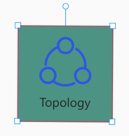
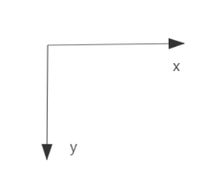
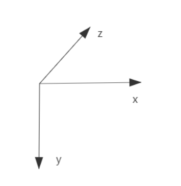

# 设计概要
乐吾乐 Topology，一个高效的可视化web绘图工具，我们希望任何人都能通过本平台搭建自己的可视化平台，不让工具成为限制自己生产力的障碍。Topology除了可以用来绘制常见的流程图、脑图、UML图、电路图等基本图形界面，更可用于高端数字大屏、物联网平台可视化、智慧城市等划时代产品的图表设计。在满足各行各业人员对高质量图表设计需求的同时，Topology提供了设计上最大的自由度，可高度个性化定制数据可视化界面，既能使用简单的拖拽组件元素功能和画笔绘制工具表现出所需要的功能画面，还有丰富的API接口用于实现后端接口与画面、用户与组件、组件与组件之间的任意交互功能。我们希望即使是非专业的前端工程人员，也能通过了解基础的JavaScript/TypeScript语法和简单DOM元素操作实现画面中各元素间的动态交互效果，为客户全方位展示出你的需求和设计。
  
 **基本组成**  
**画布**是画面上所有元素的载体，在画布上添加或绘制出的各种内容都称为画布上的**画笔**元素。 
<!--  **[层](/pen)：**    
这里的层与ps里的层无关，是逻辑上存在的图层，层包含有所有的绘图数据，鼠标交互事件以及动画演示都将会在图层上进行。   -->  

 **[画布](/topology)：**    
画布上包含有所有的画笔元素，画布的大小为无限大。  

 **[画笔](/pen)：**      
画笔是我们可以进行自由绘制与设计的基础组成部分，画笔绘制（继承）的内容称为画笔元素，画笔元素从逻辑上可分为连线和图形节点两种类型，区别在于他们不同的属性可以展示出不同的性质，例如某些连线和图形具有不同的可选动画效果。  
画笔元素通常由边框、文本、图标、背景等组成。  
边框上有：
- 锚点

 **属性**  
画布和画笔元素所拥有的绘画属性和自定义数据，通过设置画布和画笔元素的属性数据可以个性定制出所需要的画布内容。详情请参阅[API文档]()。

 **画布坐标系**  
Topology同时支持原生canvas的2D坐标轴和3D坐标轴。  
 **2D坐标轴**  
通过(x,y)坐标用于点的定位。

  
 **3D坐标轴**  
z轴用于设置画笔元素上下级的层次关系。z值大的画笔元素将覆盖小的画笔元素。

[Topology 在线使用](http://topology.le5le.com)